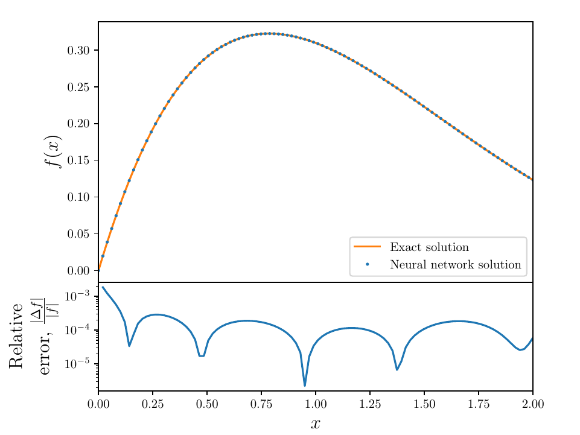

[](https://python.org)
[](https://tensorflow.org)
# Neural Network ODEsolver
| &nbsp;        | &nbsp;           |
| ------------- |:-------------:|
|**NN ODEsolver:**  | Code that numerically solves ODEs using Neural Networks in an unsupervised manner|
| **Authors:**  |[Liam L.H. Lau](https://github.com/LiamLau1), [Denis Werth](https://github.com/deniswerth)|
| **Version:**  | 1.0|
| **Homepage:**  | [https://github.com/deniswerth/NeuralNetwork_ODEsolver](https://github.com/deniswerth/NeuralNetwork_ODEsolver)|
## Motivations
Feedforward neural networks are able to approximate any continuous function at any level of accuracy. This is a loose statement of the Universal Approximation Theorem for neural networks. Although there is open source code for neural network solvers for ODEs and PDEs, the difference is that this network trains to fit the differential equation and boundary/ initial conditions at the same time. We also suggest that the loss is approximately the mean absolute error, without the need of having the true solution. 

The paper can be found here:

All examples from the paper can be reproduced with the code provided, a walk through is provided in the examples section below.

## Usage
### Main code in `__Main__.py`:
* To replicate the plots in the paper and in **Examples** below, comment out all the `if __name__ == "__main__":` sections except the particular example you want to keep.

### Neural Network Solver class in `ODEsolver.py`:
Imported in `__Main__.py` by:

```python
from ODEsolver import ODEsolver
```

Initialization of the class is executed in `__Main__.py` like so:

```python
ODEsolver(order, diffeq, x, initial_condition, epochs, architecture, initializer, activation, optimizer, prediction_save, weights_save)
```

| Argument  | Description  | Example |
| ------------- |:-------------:|:-------------:|
| **Order:** *int* | Order of the differential equation | 2 |
| **diffeq:** *string* | Differential equation name | "schrodinger" |
| **x:** *ndarray* | Sampled domain | `np.linspace(-5, 5, 100)` |
| **initial_condition:** *tuple* | Initial condition for the differential equation | ((x0, y0), (dx0, dy0)) |
| **epochs:** *int* | The number of epochs the neural net is trained for | 10000 |
| **architecture:** *list* | Architecture of the densely connected hidden layers | [30, 30, 30]|
| **initializer:** *string* | Initializer of the neural network parameters | "GlorotNormal" |
| **activation:** *string* | Activation function used for the hidden layers | "sigmoid" |
| **optimizer:** *string* | optimizer used for gradient descent | "Adam" |
| **prediction_save:** *bool* | Toggle for whether the prediction at each epoch is saved. Used for animation | True/False |
| **weights_save:** *bool* | Toggle for whether the weights and biases at each epoch are saved. Can be used for trajectory plots on the loss surface| True/False |


### Dictionary class in `Dictionary.py`:
Imported in `__Main__.py` by:

```python
from Dictionary import Dictionary
D = Dictionary()
Dict = D.Dict
```

* Dictionary class that contains the initializers, activation functions and optimizers that 

### Differential equation class in `DiffEq.py`:
Imported in `__Main__.py` by:

```python
from DiffEq import DiffEq
```

* Differential equation class that contains definition of differential equation problem. Three examples are given: a first order ODE; n<sup>th</sup> stationary Schrodinger equation with a harmonic potential and a burst equation.
A custom differential equation can be defined as the following in `DiffEq.py`:
```python
if self.diffeq == "name":
    # x should be written as self.x; y should be written as self.y; dy/dx should be written as self.dydx and d2y/dx2 should be written as self.d2ydx2
    self.eq = self.d2ydx2 + self.dydx + self.y - tf.math.exp(-self.x) # Your custom differential equation

```
* Currently, the code only supports up to second order. However **higher order derivatives** can be implemented by editing the `y_gradients` function for the Neural Network Solver class in `ODEsolver.py`. For example, third order can be accessed by using the following code snippet:
```python
def y_gradients(self, x):
    """
    Computes the gradient of y.
    """
    with tf.GradientTape() as tape1:
        tape1.watch(x)
        with tf.GradientTape() as tape2:
            tape2.watch(x)
            with tf.GradientTape() as tape3:
                tape3.watch(x)
                y = self.NN_output(x)
            dy_dx = tape3.gradient(y, x)
        d2y_dx2 = tape2.gradient(dy_dx,x)
    d3y_dx3 = tape1.gradient(d2y_dx2,x)
    return y, dy_dx, d2y_dx2, d3y_dx3
```
Make sure to edit the `differential_cost` function for the Neural Network Solver class in `ODEsolver.py` to include the extra derivatives:

```python
y, dydx, d2ydx2, d3ydx3 = self.y_gradients(x)
```

```python
de = DiffEq(self.diffeq, x, y, dydx, d2ydx2, d3ydx3)
```
Also make sure to also edit the `custom_cost` function in `ODEsolver.py` to include extra boundary terms, an example is given for a third order derivative:
```python
if self.order == 3:
    x0 = np.float64(self.initial_condition[0][0])
    y0 = np.float64(self.initial_condition[0][1])
    dx0 = np.float64(self.initial_condition[1][0])
    dy0 = np.float64(self.initial_condition[1][1])
    d2x0 = np.float64(self.initial_condition[2][0])
    d2y0 = np.float64(self.initial_condition[2][1])
    def loss(y_true, y_pred):
        differential_cost_term = tf.math.reduce_sum(self.differential_cost(x))
        boundary_cost_term = tf.square(self.NN_output(np.asarray([[x0]]))[0][0] - y0)
        boundary_cost_term += tf.square(self.NN_output(np.asarray([[dx0]]))[0][0] - dy0)
        boundary_cost_term += tf.square(self.NN_output(np.asarray([[d2x0]]))[0][0] - d2y0)
        return differential_cost_term/self.n + boundary_cost_term
    return loss
```

The third order derivative will now be available in `DiffEq.py` using `self.d3ydx3`

## Examples
### First order ODE example:
%20%2B%20f(x)%20%3D%20e%5E%7B-x%7D%20%5Ccos(x))



### Schrodinger equation example:
%20%2B%202m(E_n%20-%20V(x))%5Cpsi(x)%20%3D%200)


### Burst equation example:
%20%2B%20%5Cfrac%7Bn%5E2%20-%201%7D%7B(1%2Bx%5E2)%5E2%7D%20f(x)%20%3D%200)


